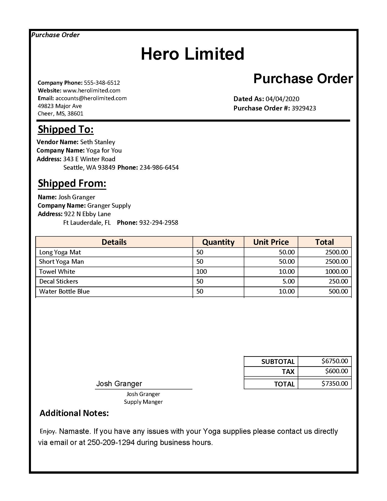

# FormDataReadDocumentIntelligence

This project uses **Azure AI Document Intelligence** (Form Recognizer) to train a custom model on labeled form images and then test it against new forms. It includes C# console apps for training and testing.

## Prerequisites

- **Azure subscription** and **Azure AI Document Intelligence** (Form Recognizer) resource
- **.NET 8 SDK** — [Download](https://dotnet.microsoft.com/download)
- **Azure CLI** (for setup script) — [Install](https://docs.microsoft.com/en-us/cli/azure/install-azure-cli)
- **Git** (for cloning and pushing)

## Project structure

```
FormDataReadDocumentIntelligence/
├── C-Sharp/
│   ├── train-model/     # Trains a custom form model from sample forms in Azure Blob
│   └── test-model/      # Runs the trained model on a test image (e.g. test1.jpg)
├── sample-forms/        # Labeled form images + labels used for training
├── setup.sh             # Creates Azure Storage, uploads sample forms, prints SAS URI
├── setup.cmd            # Windows equivalent (use setup.sh on macOS/Linux)
└── README.md
```

---

## 1. train-model

Trains a **custom Form Recognizer model** using labeled forms stored in an Azure Blob container (SAS URI). The app uses `FormTrainingClient` to start training and waits until the model is ready, then prints the **Model Id** and status.

### Configuration

Copy the example config and add your values:

```bash
cd C-Sharp/train-model
cp appsettings.example.json appsettings.json
```

Edit `appsettings.json`:

- **FormEndpoint** — Your Document Intelligence endpoint (e.g. `https://<your-resource>.cognitiveservices.azure.com/`)
- **FormKey** — Your Document Intelligence API key
- **StorageUri** — SAS URI to the blob container that holds the labeled sample forms (from `./setup.sh`)

### Build and run

```bash
cd FormDataReadDocumentIntelligence/C-Sharp/train-model
dotnet restore
dotnet build
dotnet run
```

### Example output

```
Custom Model Info:
    Model Id: ee6603fa-d554-4a71-9659-0f5e7d1c0974
    Model Status: Ready
    Training model started on: 2/10/2026 8:18:44 AM +00:00
    Training model completed on: 2/10/2026 8:18:47 AM +00:00
```

**Copy the Model Id** — you will need it for the test-model `appsettings.json` as `ModelId`.

---

## 2. test-model

Uses the **trained custom model** to analyze a form image (e.g. `test1.jpg`). It reads the image from disk, calls `StartRecognizeCustomForms` with the model id, and prints each recognized field name, value, label, and confidence.

### Configuration

Copy the example config and add your values:

```bash
cd C-Sharp/test-model
cp appsettings.example.json appsettings.json
```

Edit `appsettings.json`:

- **FormEndpoint** — Same Document Intelligence endpoint as train-model
- **FormKey** — Same API key
- **ModelId** — The Model Id printed by train-model (e.g. `ee6603fa-d554-4a71-9659-0f5e7d1c0974`)

### Build and run

```bash
cd FormDataReadDocumentIntelligence/C-Sharp/test-model
dotnet restore
dotnet build
dotnet run
```

### Test image and document recognition

The test-model app analyzes **test1.jpg**, a sample purchase-order form. The image is in `C-Sharp/test-model/` and is processed by the trained custom model to extract fields such as vendor, company, totals, and contact details.



**Terminal execution and response** — running `dotnet run` in the test-model folder produces recognition output like the following:

```bash
cd FormDataReadDocumentIntelligence/C-Sharp/test-model
dotnet run
```

```
Form of type: custom:0b6d041e-98ae-45a8-9ce5-e4313716f814
Field 'Signature':
    Value: 'Josh Granger'
    Confidence: 0.995
Field 'Website':
    Value: 'www.herolimited.com'
    Confidence: 0.939
Field 'Subtotal':
    Value: '$6750.00'
    Confidence: 0.995
Field 'CompanyAddress':
    Value: '343 E Winter Road Seattle, WA 93849 Phone:'
    Confidence: 0.995
Field 'Quantity':
    Value: '50'
    Confidence: 0.99
Field 'PhoneNumber':
    Value: '555-348-6512'
    Confidence: 0.98
Field 'Tax':
    Value: '$600.00'
    Confidence: 0.99
Field 'PurchaseOrderNumber':
    Value: '3929423'
    Confidence: 0.995
Field 'DatedAs':
    Value: '04/04/2020'
    Confidence: 0.99
Field 'VendorName':
    Value: 'Seth Stanley'
    Confidence: 0.995
Field 'CompanyName':
    Value: 'Yoga for You'
    Confidence: 0.96
Field 'Total':
    Value: '$7350.00'
    Confidence: 0.99
Field 'Merchant':
    Value: 'Hero Limited'
    Confidence: 0.96
Field 'Email':
    Value: 'accounts@herolimited.com'
    Confidence: 0.995
Field 'CompanyPhoneNumber':
    Value: '234-986-6454'
    Confidence: 0.99
```

This output shows Azure Document Intelligence recognizing the form type and each field (name, extracted value, and confidence score).

### Example output (minimal)

```
Form of type: form_0
Field 'field_name':
    Label: '...'
    Value: '...'
    Confidence: 0.99
...
```

---

## One-time setup (Azure Storage + sample forms)

From the repo root, run the setup script to create a storage account, container, and upload `sample-forms/`, then get a SAS URI for training. Update the variables in `setup.sh` to match your subscription and resource group.

**Login to Azure (if needed):**

```bash
az login
```

**Run setup (macOS/Linux):**

```bash
cd FormDataReadDocumentIntelligence
chmod +x setup.sh
./setup.sh
```

Copy the printed **SAS URI** into `C-Sharp/train-model/appsettings.json` as `StorageUri`, then run train-model. After training, copy the **Model Id** into `C-Sharp/test-model/appsettings.json` as `ModelId` and run test-model.

---

## Quick command reference

| Step            | Command |
|-----------------|--------|
| Azure login     | `az login` |
| Run setup       | `./setup.sh` (from FormDataReadDocumentIntelligence) |
| Train model     | `cd C-Sharp/train-model && dotnet run` |
| Test model      | `cd C-Sharp/test-model && dotnet run` |

---

## Pushing this project to GitHub

From the `FormDataReadDocumentIntelligence` folder:

```bash
./push-to-github.sh
```

If GitHub CLI is not logged in, you will be prompted to run:

```bash
gh auth login
```

Then run `./push-to-github.sh` again to create the repository **FormDataReadDocumentIntelligence** and push your commits.

---

## License

Based on Microsoft Learn AI-102 lab content. Use according to your organization's and Microsoft's terms.
